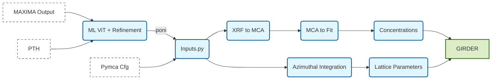

# Dagster for AIMD-L MAXIMA

```mermaid
graph LR
    %% Styles
    classDef file fill:#fff,stroke:#333,stroke-width:1px,stroke-dasharray: 5 5;
    classDef process fill:#e1f5fe,stroke:#01579b,stroke-width:2px;
    classDef final fill:#dcedc8,stroke:#33691e,stroke-width:2px;

    %% Nodes
    MAX[MAXIMA Output]:::file
    PTH[PTH]:::file
    CFG[Pymca Cfg]:::file
    
    ML(ML ViT + Refinement):::process
    INPUT(Inputs.py):::process
    
    %% Top Branch - XRF
    XRF(XRF to MCA):::process
    FIT(MCA to Fit):::process
    CONC(Concentrations):::process
    
    %% Bottom Branch - Diffraction
    AZI(Azimuthal Integration):::process
    LAT(Lattice Parameters):::process
    
    GIR[GIRDER]:::final

    %% Flow
    MAX --> ML
    PTH --> ML
    ML -- poni --> INPUT
    CFG --> INPUT
    
    INPUT --> XRF
    XRF --> FIT
    FIT --> CONC
    CONC --> GIR
    
    INPUT --> AZI
    AZI --> LAT
    LAT --> GIR
```